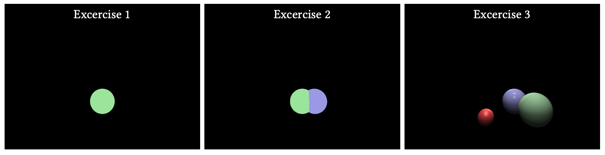
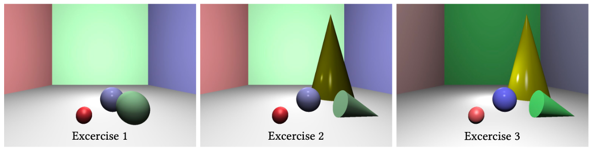

# Computer Graphics Assignments

**Team Members**: Giovanni Barbieri & Raphael Brunold

This is the repository for the Course ***Computer Graphics***, Fall Semester 2025, Università della Svizzera italiana

-------

## Assignment 1
**Spheres with Phong lighting model** 
Exercise 1: One object (sphere) 
Exercise 2: Multiple objects 
Exercise 3: Phong lighting model 

**Desired output:**

-------

## Assignment 2
**Transformations & Tone Mapping** 
Exercise 1: Planes 
Exercise 2: Cones 
Exercise 3: Improved lighting 

**Desired output:**

-------