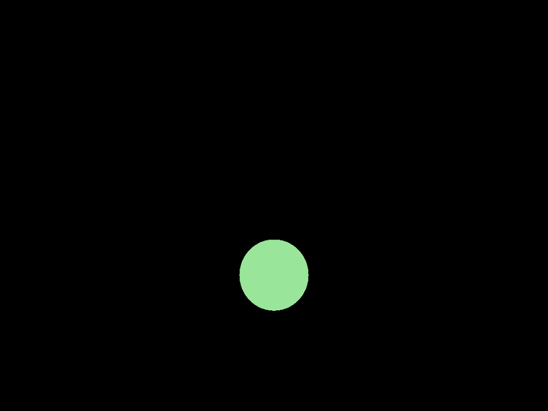
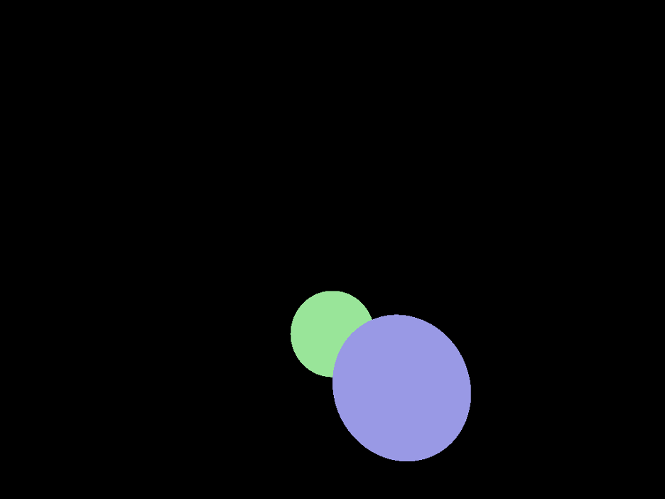
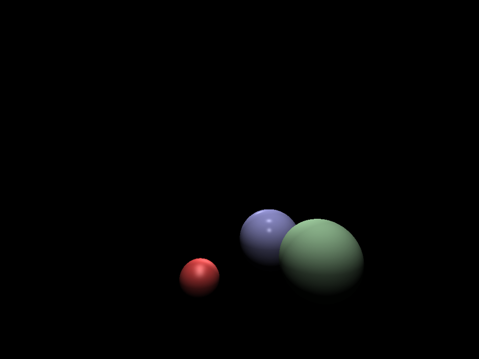
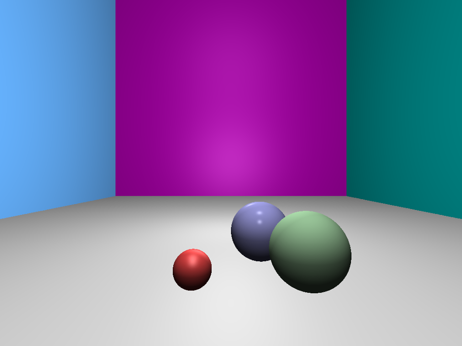
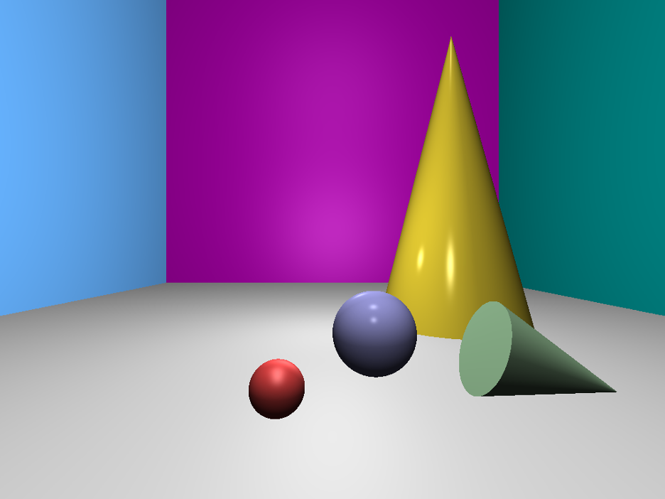
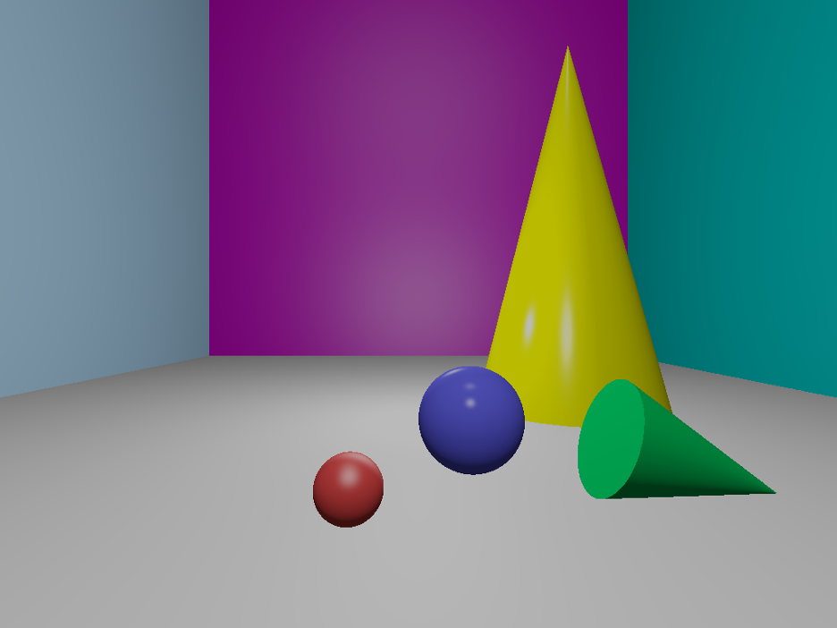
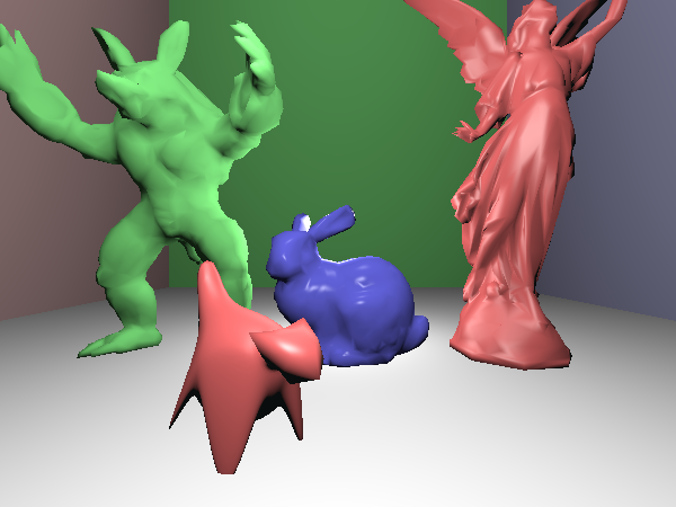
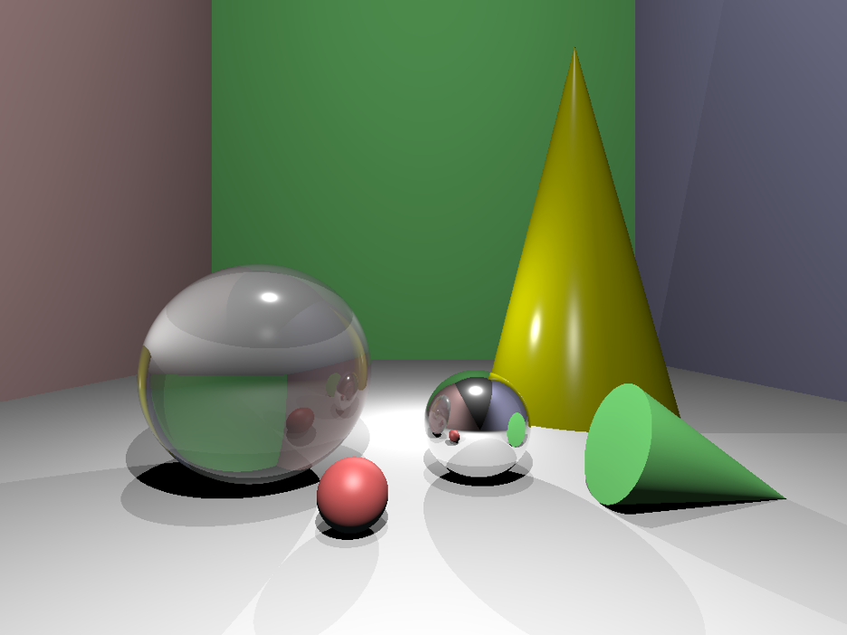

# Computer Graphics Assignments

**Team Members**: Giovanni Barbieri & Raphael Brunold

This is the repository for the Course ***Computer Graphics***, Fall Semester 2025, Università della Svizzera italiana

-------

## Assignment 1
### Spheres with Phong lighting model
- **Exercise 1:** One object (sphere)
- **Exercise 2:** Multiple objects
- **Exercise 3:** Phong lighting model

#### Results:
Exercise 1   | Exercise 2  | Exercise 3
:-----------:|:-----------:|:-----------:
 |  | 

-------

## Assignment 2
### Transformations & Tone Mapping
- **Exercise 1:** Planes
- **Exercise 2:** Cones
- **Exercise 3:** Improved lighting - Distance attenuation, tone mapping and gamma correction

#### Results:
Exercise 1   | Exercise 2  | Exercise 3
:-----------:|:-----------:|:-----------:
 |  | 

-------

## Assignment 3
### Meshes
- **Exercise 1:** Triangles, OBJ file parsing (loading meshes from files)
- **Exercise 2:** Smoothing
- **Exercise 3 (Bonus):** Design own mesh in Blender and display it

#### Result:
Meshes, Smooth Shading, Custom Mesh|
:-------:

-------

## Assignment 4
### Shadows, Reflection, and Refraction
- **Exercise 1:** Add shadows to Phong Lighting
- **Exercise 2:** Reflections
- **Exercise 3:** Refractions
- **Exercise 4:** Fresnel Effect

#### Result:
Shadows, Reflections, Refractions, Fresnel Effect|
:-------:
